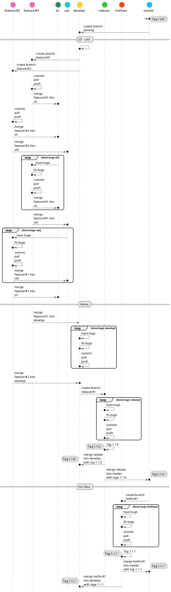

```plantuml
        @startuml
        skinparam shadowing false
        skinparam ArrowColor #dimgray
        skinparam EntityBorderColor #gray
        skinparam SequenceLifeLineBorderColor #gray
        skinparam NoteBorderColor #grey
        skinparam NoteBackgroundColor #gainsboro
        skinparam SequenceDividerBorderColor #gray
        skinparam SequenceDividerFontStyle normal
        skinparam roundcorner 15
        skinparam maxmessagesize 100
        hide footbox

        entity "feature/#2" as feature_2 #hotpink
        entity "feature/#1" as feature_1 #hotpink
        entity sit #seagreen
        entity uat #darkturquoise
        entity develop  #gold
        entity release #limegreen
        entity hotfixes  #orangered
        entity master  #deepskyblue

        ?->o master
        note right : Tag 1.0.0
        master ->o develop: create branch develop

        == SIT - UAT ==
        develop ->o develop
        develop ->o feature_1: create branch feature/#1
        develop ->o feature_2: create branch feature/#2
        feature_1 ->o feature_1: commit \npull \npush
        feature_1 ->o sit : merge feature/#1 into sit
        feature_2 ->o feature_2: commit \npull \npush
        feature_2 ->o sit: merge feature/#2 into sit
        feature_2 ->o uat: merge feature/#2 into uat 
        loop done bugs sit
            sit ->o feature_1: have bugs
            feature_1 ->o feature_1: fix bugs
            feature_1 ->o feature_1: commit \npull \npush
            feature_1 ->o sit: merge feature/#1 into sit
        end
            feature_1 ->o uat: merge feature/#1 into uat

        loop done bugs uat
            uat ->o feature_2: have bugs
            feature_2 ->o feature_2: fix bugs
            feature_2 ->o feature_2: commit \npull \npush
            feature_2 ->o uat: merge feature/#1 into uat
        end
            feature_2 ->o sit: merge feature/#1 into sit

        == Golive ==
        feature_1 -> develop: merge feature/#1 into develop
        loop done bugs develop
            develop ->o develop: have bugs
            develop ->o develop: fix bugs
            develop ->o develop: commit \npull \npush
        end
        feature_2 ->o develop: merge feature/#2 into develop

        develop ->o release: create branch release/#1
        loop done bugs release
            release ->o release: have bugs
            release ->o release: fix bugs
            release ->o release: commit \npull \npush
        end
        release ->o release: Tag 1.1.0
        note left: Tag 1.1.0

        release ->o develop: merge release into develop with tag 1.1.0
        note left: Tag 1.1.0

        release ->o master: merge release into master with tage 1.1.0
        note right: Tag 1.1.0

        == Hot fixes ==
        master ->o hotfixes: create branch hotfix/#1
        loop done bugs hotfixes
            hotfixes ->o hotfixes: have bugs
            hotfixes ->o hotfixes: fix bugs
            hotfixes ->o hotfixes: commit \npull \npush
        end
            hotfixes ->o hotfixes: Tag 1.1.1
            note left: Tag 1.1.1
            hotfixes ->o master: merge hotfix/#1 into master with tag 1.1.1
            note right: Tag 1.1.1

            hotfixes ->o develop: merge hotfix/#1 into develop with tage 1.1.1
            note left: Tag 1.1.1
    @enduml
```

### Tài liệu tham khảo

[nvie](https://nvie.com/posts/a-successful-git-branching-model)
[qiita](https://qiita.com/ogomr/items/36350d515434d6674caa)