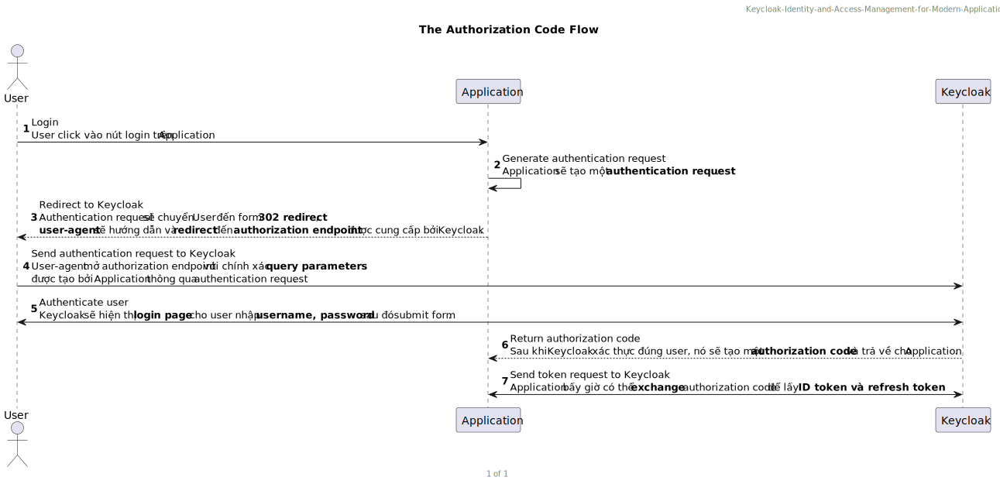

# Chapter 4: Authenticating Users with OpenID Connect

Trong chương này chúng ta sẽ hiểu sâu về cách Keycloak cho phép bạn authentication user trong applications bằng cách tận dụng ***OpenID Connect (OIDC) standard***.
Trong chương này chúng ta sẽ tìm hiểu các topics chính sau:

- Running the OpenID Connect playground.
- Understanding the Discovery endpoint.
- Authenticating a user.
- Understanding the ID token.
- Invoking the UserInfo endpoint.
- Dealing with users logging out.

## Running the OpendID Connect playground

Runing được application trong thư mục **ch4**

---

## Understanding the Discovery endpoint

***OIDC Discovery*** rõ ràng quan trọng với cả khả năng tương tác và sử dụng thư viện **OIDC Relying Party**. Ngoài ra bạn có thể phải manual configuration để có app thể authenticate với **OpenID Provider**
Base URL [baseURL/.well-know/openid-configuration](https://www.keycloak.org/docs/latest/securing_apps/index.html#endpoints) để biết về *OpendID Provider* của bạn, một *Relying Party* và tìm hiểu nhiều thông tin bạn được cung cấp. Bạn có thể load từ standard endpoint trên và gọi nó là ***OpenId Provider Metadata***. Các thuộc tính cần chú ý như:

- `authorization_endpoint`: URL dùng để request authentication.
- `token_endpoint`: URL dùng để request token.
- `introspection_endpoint`: URL dùng để request introspection.
- `userinfo_endpiont`: URL dùng để request UserInfo
- `grant_types_supported`: Danh sách hỗ trợ grant types.
- `response_types_supported`: Danh sách hỗ trợ response type

## Authenticating a user

Hầu hết các trường hợp user authenticate với Keycloak đều sữ dụng ***OpenID Connect authorization code flow***

<!--
```
    @startuml TheAuthorizationCodeFlow
    
        header Keycloak-Identity-and-Access-Management-for-Modern-Applications
        title The Authorization Code Flow

        actor "User" as user
        participant "Application" as app
        participant "Keycloak" as keycloak

        autonumber 1
        
        user -> app: Login \nUser click vào nút login trên //Application//.

        app -> app: Generate authentication request \n//Application// sẽ tạo một **authentication request**.
        
        app --_> user: Redirect to Keycloak \n//Authentication request// sẽ chuyển //User// đến form **302 redirect**, \n**user-agent** sẽ hướng dẫn và **redirect** đến **authorization endpoint** được cung cấp bởi //Keycloak//.
        
        user -> keycloak: Send authentication request to Keycloak \n//User-agent// mở //authorization endpoint// với chính xác **query parameters** \nđược tạo bởi //Application// thông qua //authentication request//.
        
        user <-> keycloak: Authenticate user \n//Keycloak// sẽ hiện thị **login page** cho user nhập **username, password** sau đó //submit form//.
        
        keycloak --_> app: Return authorization code \nSau khi //Keycloak// xác thực đúng user, nó sẽ tạo một **authorization code** và trả về cho //Application//.
        
        app <-> keycloak: Send token request to Keycloak \n//Application// bấy giờ có thể **exchange** //authorization code// để lấy **ID token và refresh token**.

        footer %page% of %lastpage%
    @enduml
```
-->


### Authorization Endpoint

    /realms/{realm-name}/protocol/openid-connect/auth

**Authorization Endpoint** sẽ thực hiện authentication của end-user và user-agent sẽ redirecting dến login page của *Keycloak*  với thuộc tính như:

- `client_id`: Client ID được dăng ký với *Keycloak*.
- `scope`: Giá trị mặc định là **openid**, hiểu là chúng ta sẽ doing một *OpenID request*.
- `prompt`:
  - `none`: Không hiển thị login screen, nhưng chỉ authentication khi user đã login trước đó với *Keycloak*.
  - `login`: Ngược với `none` hệ thống sẽ yêu cầu login với *Keycloak*.
- `max-age`: Số giây lớn nhất kể từ thời điểm authentication cuối với *Keycloak*. VD: Nếu cài đặt là **60** thì sẽ user **re-authentication** *Keycloak*.
- `login_hint`: Sẽ tự động hiện thị trường username trong login page.

Bạn sẽ thấy chi tiết các thuộc tính của [Authorization Endpoint](https://www.keycloak.org/docs/latest/securing_apps/index.html#authorization-endpoint)

### Token Endpoint

    /realms/{realm-name}/protocol/openid-connect/token

**Token Endpoint** sử dụng để lấy `tokens`. Token được lấy khi trao đổi một authorization code hoặc cung cấp credentials phụ thuộc theo *flow* mà ta sử dụng. *Token endpoint* cũng được sử dụng để lấy new `access token` khi hết hạn.
Các thuộc tính quan trọng chú ý từ kết quả *response của token endpoint*:

- `access_token`: Trong *Keycloak* là một *JWS*. Tìm hiểu trong chương tiếp theo.
- `expires_in`: Tìm hiểu sau
- `refresh_token`: Tìm hiểu sau
- `refresh_token_expires_in`: Tìm hiểu sau
- `token_type`: Đây là type của `access_token`. Trong *Keycloak* nó luôn là `bearer`.
- `id_token`: Chúng ta sẽ tìm hiểu trong mục tiếp theo.
- `session_state`: Đây là *ID* của`session` user với *Keycloak*.
- `scope`: Application yêu cầu một scope từ *Keycloak* trong *authentication request*, nhưng kết quả *scope* của *token* có thể không trùng khớp với *requested scope*.

Bạn sẽ thấy chi tiết các thuộc tính của [Token Endpoint](https://www.keycloak.org/docs/latest/securing_apps/index.html#token-endpoint)

---

## Understanding the ID token

### ID Token

**ID token** mặc định là một signed **JSON Web Token (JWT)**, được format `<Header>.<Payload>.<Signature>`
Các thuộc tính cần chú ý trong *Payload*:

- `exp`: Thời gian hết hạn của *token*.
- `iat`: Thời điểm *token* được phát hành.
- `auth_time`: Thời điển user last authenticated.
- `jti`: The unique identifier của *token*.
- `aud`: The audience (người chứng kiến, làm chứng) của *token*, chứa một  *Relying Party* that is authenticating the user.
- `azp`: The party the token was issued to.
- `sub`: The Unique identifier của authenticated user.

### Refresh Token

Một lưu ý trong response của *refresh token* có một thuộc tính `refresh_token`. Nó rất quan trọng cho application update new *refresh_token* cho lần tiếp theo. Nó quan trọng với một vài ý do:

- **Key rotation**:
- **Sesion idle**: 
- **Refresh tokn leak detection**

Một tiện ít khác của *refresh token* là application của bạn có thể update lại information về user từ *Keycloak* mà không cần phải *re-authenticate*.

### Updating the user profile