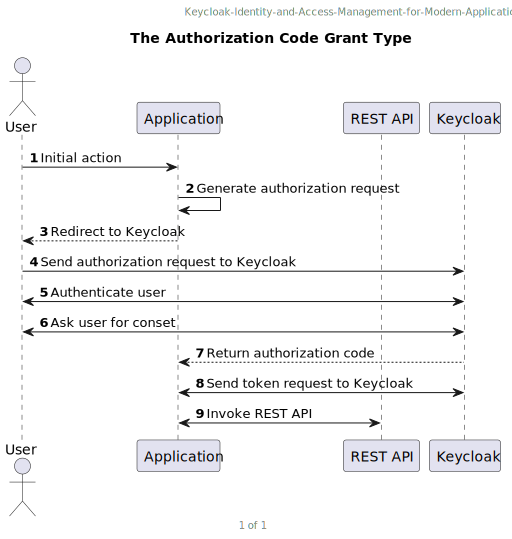

# Chapter 5: Authorizing Access With OAuth 2.0

## Technical requirements

## Runing the OAuth 2.0 playground

## Obtaining an access token

<!--
    ```
        @startuml TheAuthorizationCodeGrantType
            header Keycloak-Identity-and-Access-Management-for-Modern-Applications
            title The Authorization Code Grant Type

            actor "User" as user
            participant "Application" as application
            participant "REST API" as restApi
            participant "Keycloak" as keycloak

            autonumber 1

            user -> application: Initial action
            application -> application: Generate authorization request
            application --_> user: Redirect to Keycloak
            user -> keycloak: Send authorization request to Keycloak
            keycloak <-> user: Authenticate user
            user <-> keycloak: Ask user for conset
            keycloak --_> application: Return authorization code
            application <-> keycloak: Send token request to Keycloak
            application <-> restApi: Invoke REST API

            footer %page% of %lastpage%
        @enduml
    ```
-->

