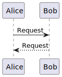

# Basic Syntax Markdown Guide

## Headings

## Paragraphs

## Line breaks

## Empphasis

- **Bold**
- *Italic*
- ***Bold and italic***

## Blockquotes
>
> Blockquotes

## List

### Order lists

1. First item
2. Second item
3. Third item

### Unordered lists

- First item
- Sendcond item
- Third item

## Code blocks

    Code blocks are normaly indented four space or one tab

## Code

`code`

## Escaping Backticks

``User `code` in the markdown file .``

## Horizontal Rules

---

## Links

This is link of [google](https://google.com)

## Add titles - Tooltip

This is a lik of [google](https://google.com "google tooltip")

## URLs and Email addresses

<https://www.markdownguide.org>
<fake@example.com>
plantuml.1.2023.6.jar

## Images

<https://www.markdownguide.org/basic-syntax/#images-1>

## Integrate PlantUML

1. Viết code diagram với syntax PlantUML
<!--
```
    @startuml integratePlantuml
        Alice -> Bob: Request
        Bob --_> Alice: Request
    @enduml
```
-->


2. Dùng tổ hợp phím `Ctr + Atl + P`. Sau đó gõ `PlantUML: Export Current File Diagrams`
3. Embed path image ``
